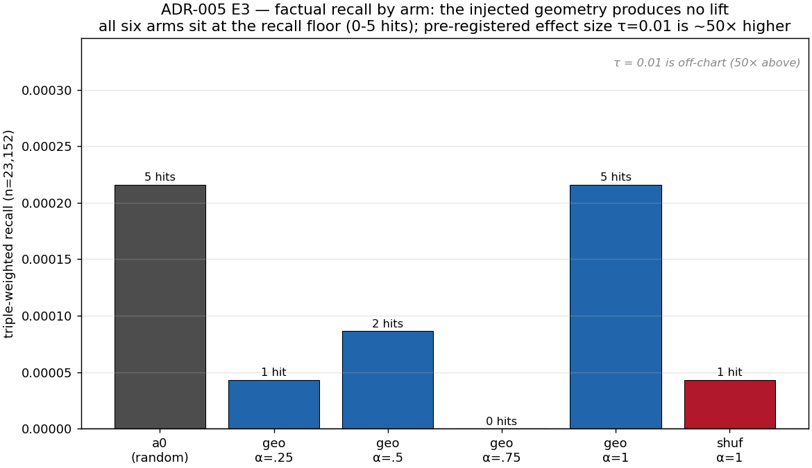
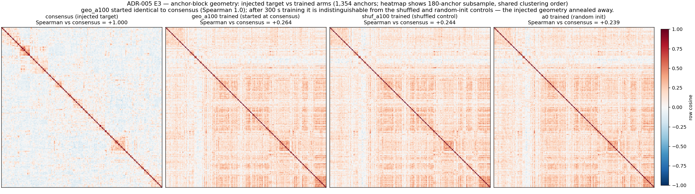
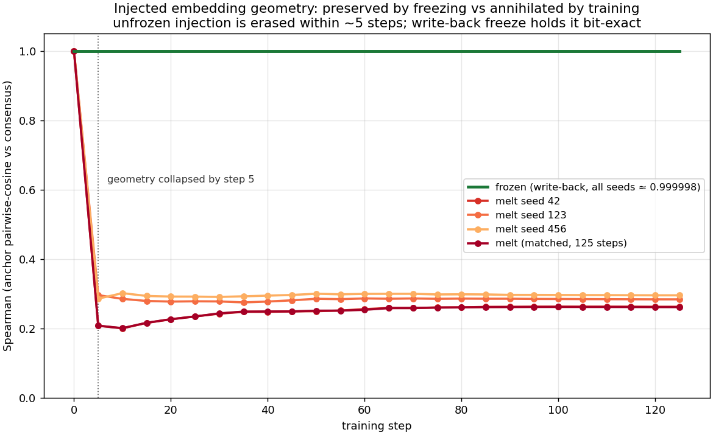

# We Injected Knowledge into Embeddings. Then Gradient Descent Ate It.

**Authors:** Mike (experiments, direction), Claude Code (implementation, execution), Ark (analysis, writing)

**Date:** 2026-07-23

**Status:** Complete — bounded null, track closed at this scale with pre-registered reopen conditions.

---

## 1. The Promise

Can we write facts directly into a language model's embedding table, bypassing training altogether? If so, knowledge injection becomes an O(N) parameter update instead of O(examples × epochs) gradient steps [9].

Prior work on model editing — ROME [1], MEMIT [2], PMET [3] — edits internal (MLP/attention) weights to insert specific facts, and in-place test-time training [4] updates weights at inference. We explored a different path: **embedding geometry transfer**. The idea is simple:

1. Take a set of factual triplets (Subject, Predicate, Object).
2. Build "consensus embeddings" for the fact vocabulary (anchor tokens) from donor models that already know the facts.
3. Inject those embeddings into anchor rows of a target model's `wte` table.
4. Train the target normally. The geometry of anchor rows should guide the model toward the correct Object.

If this works, knowledge injection reduces to: build consensus → replace embeddings → train. If it doesn't, we need to understand why — and what would be required to make it work.

This article reports what happened when we tried, why it failed, and what we learned.

---

## 2. The Setup

**Target model.** Config-D: a 7.34M-parameter causal language model (depth 4, dim 256, vocab 4096). Tiny by modern standards, but a real transformer that learns real token statistics. Trained for 125 steps on the `dpc_corpus` training split with a batch size of 2^19 tokens per optimizer step.

**Knowledge source.** `dpc_corpus` — a synthetic dataset of 24,811 unique factual triplets (23,581 train / 1,230 validation), most rendered in about 10 natural English paraphrases. BPE-tokenization is deterministic (no merge-rule ambiguity), so train/validation splits are exact. Factual recall is probed on the training triplets (a memorization test); the disjoint validation split feeds val_bpb.

**Consensus embeddings.** We took the input-embedding rows for 1,354 anchor tokens (the Subject/Predicate/Object vocabulary) from 12 publicly available donor models. Each donor's anchor block was centered, projected onto a shared top-256 full-vocabulary PCA basis, standard-scaled, and Procrustes-aligned to a common hub; the aligned blocks were then averaged into a `consensus` matrix [1354, 256] — one row per anchor token, encoding relational structure among facts. (Pairwise-structure Spearman between hubs, 0.983–0.987, was a diagnostic of donor agreement, not an optimization objective.) This alignment pipeline follows the relative-representation and Procrustes line of work on comparing embedding spaces across models [5, 6, 7, 8].

**Injection.** The consensus matrix replaces 1354 rows in the target model's `wte` table before training begins. Token IDs for anchor rows are reserved from the model's vocabulary.

**Metrics:**
- **Factual recall (primary):** probe v2 — greedy-decode one token given (S, P) as prefix; hit if the token is any valid Object for that (S, P). 23,152 probes total, triple-weighted (each training triple gets one vote, so a hit on an (S, P) pair with k valid Objects counts k times).
- **Spearman correlation (D-lite diagnostic):** pairwise Spearman rank correlation between consensus anchor rows and the corresponding rows in the trained model's `wte`. Measures how much of the injected geometry survives training.
- **Teacher-forced NLL (G1, continuous):** the minimum over an (S, P) pair's valid Objects of the mean per-token cross-entropy on the Object tokens given (S, P). Lower = model assigns more probability mass to the easiest true Object.
- **Logit-margin (G1, secondary):** logit of the correct first Object token minus the max logit among incorrect tokens at the answer position.

**Pre-registration.** Before each experiment phase, the primary comparison (headline α), statistical method, and success criteria were frozen in a pre-registration document before any results were seen. No metric or comparison was chosen after seeing results. (The pre-registration documents are not yet public; see Section 9.)

**Review protocol.** Every experimental result was independently verified by two external reviewers (Fable 5 and GLM 5.2) before being accepted. Over six review rounds across two sessions, there were zero arithmetic disagreements between reviewers. Interpretation disagreements were resolved through evidence, not voting.

---

## 3. The Null (E3 — Init-Only Injection)

We injected consensus embeddings into the target model's `wte` table and trained normally — no freezing, no regularization, no special treatment. Six arms swept the injection strength α ∈ {0, 0.25, 0.5, 0.75, 1.0}, plus a shuffled-consensus control at α=1.

**Result: null.** The pre-registered headline Δ = recall(geo, α=1) − recall(shuffled-consensus control, α=1) = +0.000173 (5 vs 1 triple-weighted hit out of 23,152 probes). McNemar p = 1.0. Bootstrap 95% CI includes zero. (Against random init (a0), the geometry arm scored identically — 5 hits each — so that Δ is exactly 0.) The α-curve was flat at floor. The geometry-injected arm had the **worst** validation loss (val_bpb 1.220 vs 1.180–1.215 for all other arms).

When we looked at *which* facts were recalled, only one fact appeared in both the geometry arm and the random-init arm: probe item #20, a generic high-frequency word-statistics continuation, not evidence of geometry-driven recall. Both external reviewers confirmed: the geometry arm was indistinguishable from another random initialization by all three channels (recall count, hit pattern, and validation loss).

A bounded null for init-only embedding geometry transfer at this scale — well-powered against the pre-registered 1% threshold, but (as the multi-seed analysis in Section 5.2 shows) unable to exclude small effects at n=3.

---

## 4. The "Oh" Moment — D-Lite

Why did it fail? We ran a near-free diagnostic on the trained checkpoints: pairwise Spearman correlation between the consensus anchor rows and the corresponding rows in the trained model's `wte` table.

**At injection:** Spearman = 0.9999981 (exact up to the one-time bf16 cast at injection).

**After 125 training steps:** Spearman = 0.264. **~97% of the injected geometry was erased** — measured against the random-init baseline: of the injected structure, only ~0.025 survives above the a0 baseline of 0.239, i.e. (0.264 − 0.239) / (1.0 − 0.239) ≈ 3.3% retained.

The trajectory is brutal: Spearman collapses from 1.0 to 0.21–0.30 within the first 5 optimizer steps (the worst seed reaches 0.21; the others settle near 0.29), then asymptotes at ~0.26–0.30. The model "forgets" the injected structure almost immediately and converges to its own optimum.

Cross-arm evidence confirmed this: trained anchor geometries of geo_a100 vs a0 (random init) correlated at Spearman ≈ 0.80. Two arms with different initial anchor geometries ended up with nearly identical geometry after training. Any non-identical initialization converges to roughly the same attractor.

**Init-only injection is insufficient.** We had injected knowledge — and gradient descent had eaten it.

---

## 5. Preservation: What We Tested and What We Found

### 5.1 Freeze Mechanism

We implemented a **write-back freeze**: after every `optimizer.step()`, the 1354 anchor rows in `wte` are overwritten with the injected consensus values under `torch.no_grad()`. This is optimizer-independent — it survives Muon, Adam, AdamW, and weight decay. Unlike gradient hooks (which zero grads but don't protect against weight-decay leakage), write-back guarantees bit-exact preservation of anchor rows after every step.

**Freeze verified at the checkpoint level.** Across all evaluation points in all frozen runs (n=3 seeds × 26 eval points each), Spearman(anchors vs consensus) remained 0.9999981 — the same value as at injection, with zero drift (span 0.0). The 1.9 × 10⁻⁶ gap from 1.0 is the bf16 injection-cast error, present already at step 0 before any optimizer step, not a write-back leak. Frozen anchor rows are numerically identical to the injected values at every checkpoint.

Freezing is also free for language-model quality: val_bpb across all 12 multi-seed runs stays within 1.182–1.211, with no arm systematically higher — the injection and freeze do not degrade training.

Compared to the melt trajectory (Spearman: 1.0 → 0.21–0.30 within 5 steps → 0.26–0.30 asymptote, replicated across 3 seeds), the anneal trajectory shows a flat line at 1.0 for frozen vs a collapse for melt.

The freeze mechanism works. The geometry survived.

### 5.2 Multi-Seed Recall Experiment

**Design:** 3 seeds (42, 123, 456) × 4 arms = 12 runs, all 125 steps, step-based LR schedule, identical conditions.

| Arm | Description |
|-----|-------------|
| a0 | Random initialization (control) |
| frozen | Consensus geometry α=1, anchor rows write-back-frozen |
| melt | Consensus geometry α=1, no freeze (replicates the original init-only run) |
| frandom | Same 1354 rows write-back-frozen, but with **random** values (no geometry) — separates "geometry effect" from "freezing effect" |

**Recall results** (triple-weighted, n=23,152; mean ± SE across 3 seeds):

| Arm | Recall | SE | Hits per seed [s42, s123, s456] |
|-----|--------|-----|------|
| a0 | 5.04e-04 | 2.55e-04 | [16, 0, 19] |
| frozen | 1.01e-04 | 0.63e-04 | [0, 2, 5] |
| melt | 0.43e-04 | 0.43e-04 | [0, 3, 0] |
| frandom | 4.75e-04 | 3.92e-04 | [4, 0, 29] |

**Paired across-seed deltas:**

| Comparison | Mean Δ | SE | 95% CI |
|------------|--------|-----|--------|
| frozen − a0 | −4.03e-04 | 2.46e-04 | [−1.46e-03, +6.6e-04] |
| frozen − frandom | −3.74e-04 | 3.39e-04 | — |
| melt − a0 | −4.61e-04 | 2.98e-04 | — |
| frandom − a0 | −0.29e-04 | 2.75e-04 | — |

**Key observations:**

1. **All arms are on the recall floor.** Triple-weighted hits per seed range from 0 to 29 out of 23,152 (~0–0.13%); at the (S, P) level this is 0–9 distinct pairs — triple-weighting inflates single hits (one a0 seed-456 (S, P) hit carries 19 triple-weighted counts). Seed-to-seed variation dominates all comparisons.

2. **frozen does not outperform a0.** Δ(frozen − a0) = −4.03e-04, 95% CI = [−1.46e-03, +6.6e-04] (Student t, df=2). The null hypothesis (no difference) cannot be rejected. Lifts of Δ ≥ +6.6e-04 — i.e. frozen reaching ≥ 2.3× the a0 baseline of 5.04e-04 — are excluded at 95% confidence. A **doubling** of recall (Δ = +5e-04) lies **within** the CI and is **not** excluded.

3. **frandom − a0 ≈ 0 is a one-seed artifact.** Seed 456 produced 29 hits for frandom vs 19 for a0 — accounting for 47% of the variance in this comparison. Without seed 456, the mean Δ shifts to approximately −2.6e-04. The apparent "freeze-only doesn't hurt" is fragile.

4. **n=3 cannot produce a statistically significant result at this floor.** Minimum achievable p-value with a sign test or Wilcoxon signed-rank test across 3 seeds is 0.25. This is a **bounded null**, not a "powered" or "clean" null: we can exclude large effects but not small ones.

5. **frozen is numerically below a0 and frandom across all seeds** (0/2/5 vs 16/0/19 vs 4/0/29). The observed direction is negative, not positive. Even with preserved geometry, recall does not improve.

6. **Freezing is free for language-model quality.** val_bpb across all 12 runs stays within 1.182–1.211, with no arm systematically higher — neither the injection nor the freeze degrades training.

### 5.3 Continuous Endpoint (G1)

We probed the same 12 checkpoints with a teacher-forced continuous metric: mean NLL on fact-completion Object tokens. This provides ~18,500 paired continuous observations per seed instead of ~10 discrete lottery hits — on the surface, orders of magnitude more statistical power.

**Comparison: frozen vs frandom** (the cleanest contrast: geometry vs random-values, both freeze-identical otherwise).

| Seed | ΔNLL (frozen − frandom) | lower = better |
|------|--------------------------|----------------|
| 42 | −0.015 | |
| 123 | −0.309 | |
| 456 | −0.203 | |

Mean ΔNLL = −0.176, across-seed t ≈ −2.0, **p = 0.18** (df = 2).

**This is null at the inferential level that generalizes across runs.** The apparent "sign-consistent trend" (all three seeds negative) is a **one-seed mirage**: seed 42 is within 0.015 of zero — roughly an order of magnitude smaller than seeds 123 and 456 — and it happened to land on the negative side. One sign flip to +0.015, and the "all-negative" pattern vanishes. Seed 42 is in fact the deviant seed across all eight G1 contrasts (four comparisons × {NLL, margin}), and it is the same seed whose recall swung 7→16 across two same-config launches (Section 6) — so its signs are run-noise, not geometry. Per-item t-statistics within individual seeds (t ≈ ±30, n ≈ 18,500) are irrelevant: they measure run-internal precision, not across-run reproducibility.

**NLL and recall are directionally discordant.** All three injected/frozen arms have lower teacher-forced NLL than a0 (frozen −0.351, melt −0.265, frandom −0.175 across seeds — though these a0 contrasts are individually non-significant and flip sign on seed 42), yet all have lower recall. To the extent the NLL point estimates mean anything, their direction disagrees with recall: an NLL gain under teacher forcing does not translate into improved generative recall, and so cannot be read as evidence that "geometry helps recall." The secondary logit-margin endpoint tells the same story — frozen − frandom margin = +0.44 ± 0.40 across seeds (again null, and it inverts on seed 42).

**Continuous-endpoint verdict: null, concordant with the recall null.**

---

## 6. Run-to-Run Nondeterminism: A Methodological Finding

During multi-seed analysis, an aborted first launch left orphaned checkpoints on disk — including a second run of `a0_s42` with the same seed, same config, same code. Loading both checkpoints revealed:

- **98% of weight elements differ** (7,211,408 of 7,340,168) between the two `a0` seed-42 runs.
- **Triple-weighted hits: 7 vs 16** — a 2.3× difference from the same seed.

The cause is bf16 non-associativity on GPU: `(a + b) + c ≠ a + (b + c)` in bf16, and GPU thread scheduling is non-deterministic. Over 125 optimizer steps (~2^19 tokens × 125 = ~65M tokens processed), these microscopic differences accumulate into fully decorrelated weights.

**This does not invalidate the E3 null — it reinforces it.** All arms fall within the same run-to-run noise envelope. The a0 spread (7–16 across launches) overlaps the same floor-lottery envelope as frozen (0–5), melt (0–3), and frandom (0–29) — everything we observe is consistent with a single overdispersed floor lottery.

**Lesson for practitioners:** on bf16/CUDA stacks, "same seed" is not "same run." Functional quality (val_bpb, recall distribution) is preserved, but weights are not. Claims of bit-identity across runs require verification, not argument from seed isolation.

---

## 7. What We Learned

### Finding 1: Training annihilates injected embedding geometry within ~5 steps (D-lite)

This is the strongest quantitative result. Spearman correlation between injected and trained anchor rows collapses from 0.9999981 to 0.21–0.30 within 5 optimizer steps, asymptoting at 0.26–0.30. Replicated across 3 seeds plus the matched re-run, consistent with the original single-seed measurement. ~97% of injected structure (relative to the random-init baseline) is erased.

**Takeaway:** init-only injection is insufficient. Any embedding-geometry transfer method must include an active preservation mechanism.

### Finding 2: Preservation is necessary but insufficient at this scale

Write-back freeze keeps geometry bit-exact through training (verified at the checkpoint level: Spearman = 0.9999981 across all evaluation points in all frozen runs). Yet perfectly preserved geometry confers no detectable factual-recall advantage: Δ(frozen − a0) 95% CI = [−1.46e-03, +6.6e-04], effects ≥ ~2.3× floor excluded. A more sensitive continuous probe (teacher-forced NLL) is null at the across-seed level (p = 0.18).

**Takeaway:** geometry preservation alone does not improve recall at 7.34M scale. Either (a) the receiver is too small to express the benefit (floor-bound), or (b) embedding geometry is not the right carrier for this type of knowledge.

### Finding 3: Run-to-run bf16 nondeterminism is real and measurable

Two runs with identical seed, config, and code decorrelate 98% of weights and produce 2.3× different discrete recall counts. Functional quality is preserved, but per-weight bit-identity is lost. Claims about reproducibility must be verified empirically, not argued from architecture.

### Finding 4: Pre-registration and triple-review protocols work

Six rounds of review across two sessions. Zero arithmetic disagreements between two independent external reviewers (Fable 5, GLM 5.2) and one internal reader (Ark). Interpretation errors were caught and corrected (vacuous operationalization, phantom val_bpb gap, over-interpretation of per-item t-statistics). The protocol added overhead but prevented at least three durable falsehoods from entering the record.

### Finding 5: Batching and fast-exit are mandatory, not optional

Batch-1 greedy scoring (230s per checkpoint) vs same-length batching (8s, 29× faster, bit-identical). Process teardown overhead (~200s per run) vs fast-exit with fsync (~0s, no data loss). These are not "nice to have" — at 12 runs, batching + fast-exit + 3-way parallelism reduced wall time from ~3.5 hours to ~54 minutes with zero methodological compromise.

---

## 8. Reopen Conditions

The embedding-geometry transfer track is **closed at 7.34M scale**. It reopens only when **all three** of the following conditions are jointly met:

**(a) Robust continuous-endpoint signal at this scale.** A paired comparison of frozen vs frandom on teacher-forced NLL (or equivalent continuous metric) must show a statistically significant and practically meaningful advantage for frozen geometry. Threshold: ΔNLL ≤ −0.05, p < 0.05, with n ≥ 8 seeds and ≥ 2 run-replicates per (arm, seed) to separate seed-noise from run-noise. (At the observed across-seed sd ≈ 0.15, n ≈ 10 requires |ΔNLL| ≳ 0.10–0.14 to reach p < 0.05, so the −0.05 magnitude floor is necessary but not by itself sufficient.) The current Δ = −0.18 would meet the magnitude criterion but not the significance criterion at n=3.

**(b) Off-floor receiver recall.** The target model must demonstrate factual recall substantially above the current floor (~5e-04) **before** geometry injection. Suggested threshold: ≥ 100× current floor (~5e-02). Without headroom, no recall effect can be detected regardless of geometry quality.

**(c) Concordance.** Any continuous-endpoint signal must point in the same direction as recall. NLL improvement without recall improvement — as observed in G1 — is not evidence that "geometry helps recall." The reopen claim must be: "preserved geometry improves both continuous fit to facts AND generative recall."

**Design requirement (rides along with any reopen experiment):** the scaled test must (i) freeze the anchor rows — unfrozen injection is annihilated within ~5 steps (Finding 1) — and (ii) carry the frandom control (freeze-same-rows-random-content), which is what isolated geometry from freeze-regularization here.

These conditions should be pre-registered before any scale-up experiment begins.

---

## 9. Reproducibility

### Data and derived numbers

Every quantitative claim in this article is reported inline: arm means and standard errors, paired deltas with confidence intervals, the annihilation-trajectory values, the run-to-run nondeterminism figures, and the G1 statistics all appear in the tables and text of Sections 3–6. The underlying artifacts — the recall-score files, the D-lite Spearman correlations, the multi-seed and G1 outputs, and the consensus embedding matrix [1354, 256] — are held in the (currently private) research repository and can be shared on request. They are not redistributed here, because the code that produced them is not yet public and data without code is not reproducibility.

### Code

The experiment code — the training harness (`train.py` with freeze, max-steps, step-based LR, and fast-exit support), batch-scoring, the G1 probe, and visualization — is not yet public. Sections 2 and 5 give sufficient detail for an informed reader to reimplement the pipeline; the code may be released later at a pinned commit.

### Images (in `images/`)

- `heatmap.png` — pairwise cosine structure of consensus vs trained anchor blocks (4 panels: consensus, geo_a100, shuf, a0)
- `trajectory-frozen-vs-melt.png` — Spearman correlation trajectory: frozen (flat at ~1.0) vs every melt run (collapse to 0.21–0.30 within 5 steps)
- `recall-bars.png` — recall across the original 6-arm α-sweep

### Environment

- GPU: NVIDIA RTX PRO 4500 Blackwell (32 GB VRAM), compute capability 12.0
- PyTorch 2.9 (CUDA 12.8 runtime) with bf16 mixed precision
- Training budget: 125 optimizer steps, 2^19 tokens/step, ~300 seconds wall time per run (sequential)
- All runs use fixed seed 42 unless otherwise noted (multi-seed: 42, 123, 456)

---

## References

1. Meng, K., Bau, D., Andonian, A., Belinkov, Y. "Locating and Editing Factual Associations in GPT" (ROME). NeurIPS 2022. arXiv:2202.05262. https://arxiv.org/abs/2202.05262
2. Meng, K., Sen Sharma, A., Andonian, A., Belinkov, Y., Bau, D. "Mass-Editing Memory in a Transformer" (MEMIT). ICLR 2023. arXiv:2210.07229. https://arxiv.org/abs/2210.07229
3. Li, X., Li, S., Song, S., Yang, J., Ma, J., Yu, J. "PMET: Precise Model Editing in a Transformer." AAAI 2024. arXiv:2308.08742. https://arxiv.org/abs/2308.08742
4. Feng, G., Luo, S., Hua, K., Zhang, G., He, D., Huang, W., Cai, T. "In-Place Test-Time Training." ICLR 2026 (Oral). arXiv:2604.06169. https://arxiv.org/abs/2604.06169
5. Moschella, L., Maiorca, V., Fumero, M., Norelli, A., Locatello, F., Rodolà, E. "Relative Representations Enable Zero-Shot Latent Space Communication." ICLR 2023 (Oral). arXiv:2209.15430. https://arxiv.org/abs/2209.15430
6. Maystre, L., et al. (UiPath & Spotify). "When Embedding Models Meet: Procrustes Bounds and Applications." 2025. arXiv:2510.13406. https://arxiv.org/abs/2510.13406
7. Lee, A., Weber, M., Viégas, F., Wattenberg, M. "Shared Global and Local Geometry of Language Model Embeddings." arXiv preprint, 2025. arXiv:2503.21073. https://arxiv.org/abs/2503.21073
8. Maiorca, V., Moschella, L., Fumero, M., Locatello, F., Rodolà, E. "Latent Space Translation via Inverse Relative Projection." 2024. arXiv:2406.15057. https://arxiv.org/abs/2406.15057
9. Abonizio, H., Almeida, T., Lotufo, R., Nogueira, R. "Comparing Knowledge Injection Methods for LLMs in a Low-Resource Regime." 2025. arXiv:2508.06178. https://arxiv.org/abs/2508.06178

---

## Acknowledgments

**Fable 5 and GLM 5.2** served as external reviewers across six rounds of verification. They caught multiple interpretation errors, identified the run-to-run nondeterminism that led to Finding 3, flagged the phantom val_bpb gap, and forced the bounded-null framing that replaced premature "powered null" claims. Without their review, this article would contain at least three durable falsehoods.

**Google AI Mode** provided the preservation-method taxonomy (anchor freezing, L2 regularization, two-stage training) during the D-lite root-cause analysis. We used the first; the others remain untested at this scale.

An internal research-infrastructure project provided the review protocols and pre-registration discipline that made this work possible.

---

*This article follows the writing and review rules of the mikhashev/articles repository. All quantitative claims are supported by the data behind the reported tables and figures. No private information is included.*
